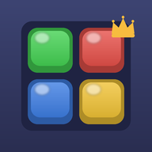
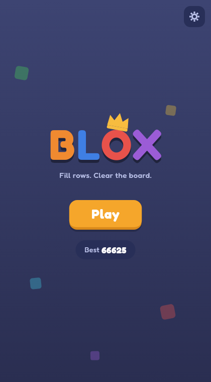
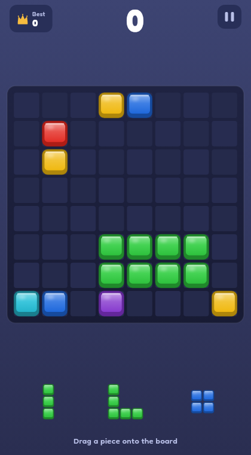
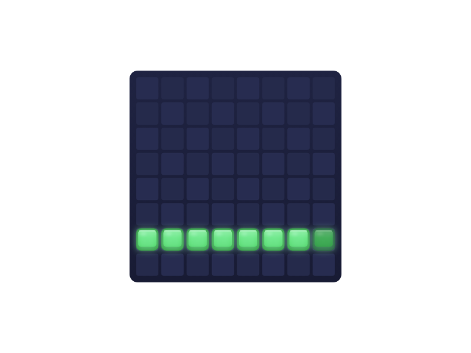

# Blox

A block puzzle game built with Flutter. Drag pieces onto the board, fill rows and columns to clear them, and chase combos as the board fills up. Runs on Android, iOS, web, Linux, macOS, and Windows from one codebase.



## Screenshots

| Menu | Gameplay | Drag preview |
|------|----------|--------------|
|  |  |  |

## How to play

You get three pieces at a time. Drag one onto the 8x8 board and it snaps into place. Fill every cell in a row or column and it clears, freeing space and scoring points. Clearing multiple lines at once (or on consecutive placements) builds a combo multiplier, which is where the real points are. When no tray piece fits anywhere on the board, the run ends and your best score is saved.

Scoring rewards planning: placement gives a few points per block, but multi-line clears and combos are worth far more. Keeping the center open and setting up double clears beats filling the board one piece at a time.

## Features

- Glossy beveled block art rendered by a single shared painter, so the board, tray, drag ghost, and app icon all match
- Drag and drop with live placement ghost and clear-line highlighting
- Score popups, block pop animations, and particle bursts on clears
- Haptic feedback on placement and clears, plus a sound toggle
- Pause, restart, and game-over flows with best-score persistence
- English and Chinese localization, with all user-facing text in ARB files
- Seeded game engine for deterministic play and testing

## Running it

Requires Flutter 3.44 or later.

```sh
flutter pub get
flutter run            # picks a connected device
flutter run -d linux   # desktop
flutter run -d chrome  # web
flutter build apk      # Android package (unsigned debug)
flutter build web      # static web bundle in build/web
```

## Project layout

```
lib/
  main.dart                     app entry point
  src/game/                     pure Dart rules: board, pieces, scoring, engine
  src/presentation/             widgets, painters, and screens
  src/theme/                    palette, typography, metrics
  src/haptics.dart              vibration abstraction
  src/sound.dart                system sound wrapper
  src/settings.dart             persisted settings (haptics, sound, best score)
l10n/                           ARB files for English and Chinese
tools/generate_icons.py         regenerates every platform icon from one design
test/
  unit/game/                    engine and rules coverage
  widget/                       screen and interaction tests
  goldens/                      golden image tests (the screenshots above)
```

The game rules under `src/game/` have no Flutter dependencies beyond `ChangeNotifier`, so every rule is exercised by plain unit tests. The dealer and score store are interfaces, which lets tests script exact piece sequences and persistence behavior.

## Testing

```sh
flutter test                     # unit, widget, and golden tests
flutter test --update-goldens    # regenerate golden baselines
flutter test --coverage          # coverage in coverage/lcov.info
```

Widget tests drive real drags onto the board, clear lines, pause, and reach game over. Golden tests pin the visual design so UI changes are reviewed in diffs, not by memory.

## Contributing

See [AGENTS.md](AGENTS.md) for the working rules: strict lints, all new code must be testable, and tests run after every change.

## License

[AGPL-3.0](LICENSE). If you build a networked service on this code, you must share your source.
